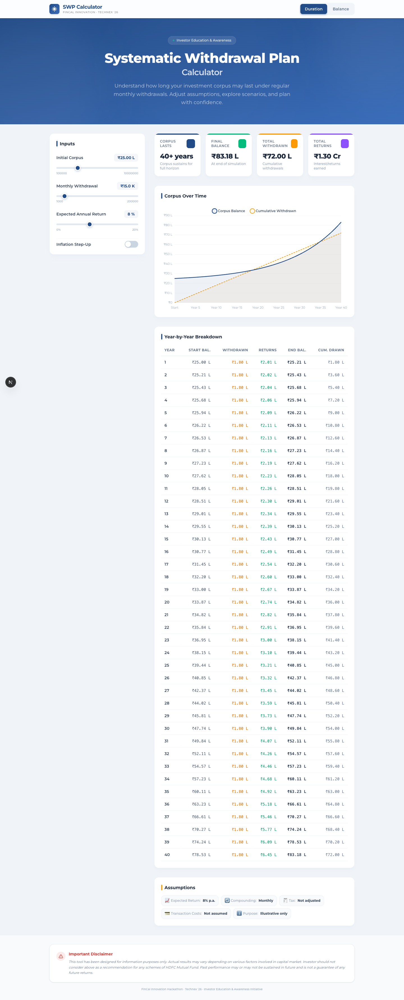
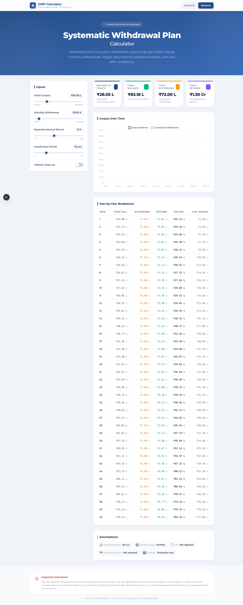
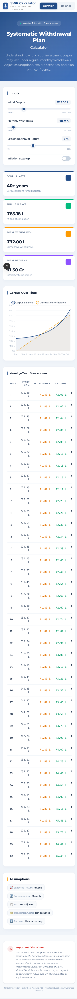

# SWP Calculator

An interactive Systematic Withdrawal Plan (SWP) calculator built with Next.js for the FinCal Innovation Hackathon at Technex '26. The app helps users estimate how long an investment corpus can sustain monthly withdrawals, compare scenarios, and understand the trade-off between withdrawals, returns, and inflation.

## Working Video
https://github.com/Anurag-M1/SWP-Calculator/blob/main/docs/SWP-Calculator-Demo.mov

## Visual Preview

### Desktop View



### Balance Mode



### Mobile View

<p align="center">
  
</p>

## Project Overview

This project is designed as an investor education tool. Users can change the initial corpus, monthly withdrawal, annual return, and optional inflation step-up to simulate the behavior of a withdrawal plan over time.

The application supports two planning modes:

- `Duration`: estimates how long the corpus lasts before depletion.
- `Balance`: shows the estimated remaining corpus after a selected number of years.

The simulation runs month by month for better accuracy and supports annual inflation-based withdrawal step-ups.

## Key Features

- Real-time SWP simulation with instant updates
- Two calculator modes: `Duration` and `Balance`
- Optional annual inflation step-up for withdrawals
- Live KPI cards for duration, final balance, total withdrawn, and total returns
- Corpus trend chart with cumulative withdrawals
- Year-wise breakdown table
- Indian-number formatting (`K`, `L`, `Cr`)
- Accessible UI with clear visual warnings on corpus depletion
- Unit-tested financial logic using Jest

## UI Highlights

- Sticky header with quick mode switching between `Duration` and `Balance`
- Clean input sidebar with sliders for corpus, withdrawal, return, and target years
- Live KPI cards for corpus duration, final balance, total withdrawn, and total returns
- Interactive chart for corpus balance and cumulative withdrawals
- Year-by-year breakdown table for easy analysis
- Mobile-friendly layout for smaller screens

## How The Calculation Works

The core logic is implemented in [`lib/swpCalc.ts`](lib/swpCalc.ts).

For an annual return `R`, the monthly rate is:

```text
r = R / 100 / 12
```

Each month, the engine:

1. Applies monthly growth to the current balance.
2. Applies the configured withdrawal.
3. Increases the withdrawal once per year if inflation step-up is enabled.
4. Stops when the corpus reaches zero or when the 40-year simulation horizon is reached.

The calculator returns:

- Month-by-month simulation rows
- Year-by-year aggregates
- Depletion month, if any
- Final balance
- Total withdrawn amount
- Total returns earned
- Target-year balance in `Balance` mode

## Default Inputs

The default scenario is defined in [`hooks/useSWP.ts`](hooks/useSWP.ts):

- Initial corpus: `₹25,00,000`
- Monthly withdrawal: `₹15,000`
- Expected annual return: `8%`
- Inflation step-up: `Off`
- Inflation rate: `5%` when enabled
- Default mode: `Duration`
- Default balance horizon: `10 years`

## User Interface Summary

The main page in [`app/page.tsx`](app/page.tsx) combines:

- A sticky header with mode toggle
- A hero section for project context
- An input panel with sliders and inflation switch
- A stats section with four result cards
- A chart showing corpus balance and cumulative withdrawals
- A year-wise breakdown table
- An assumptions box for disclosure of model assumptions
- A disclaimer footer for investor-awareness usage

## Tech Stack

- Next.js 16
- React 19
- TypeScript
- Tailwind CSS 4
- Chart.js + `react-chartjs-2`
- Jest + `ts-jest`

## Project Structure

```text
app/                 Next.js app router files
components/          UI components for calculator sections
hooks/               State and business-hook orchestration
lib/                 Pure financial calculation logic
types/               Shared TypeScript interfaces
__tests__/           Jest unit tests for SWP logic
docs/                Project report, PDF, and presentation output
```

## Local Setup

Install dependencies:

```bash
npm install
```

Run the development server:

```bash
npm run dev
```

Open [http://localhost:3000](http://localhost:3000).

## Available Scripts

- `npm run dev` - start local development server
- `npm run build` - create production build
- `npm run start` - run production build locally
- `npm run lint` - run ESLint
- `npm run test` - run Jest tests

## Test Coverage

The financial engine is covered in [`__tests__/swpCalc.test.ts`](__tests__/swpCalc.test.ts). The test suite verifies:

- Monthly rate conversion
- Core SWP formula behavior
- Corpus depletion handling
- Inflation-adjusted withdrawals
- `Balance` mode calculations
- Totals and yearly aggregation
- Edge cases such as `0%` return and low-corpus scenarios
- Reference-value checks for known cases

## Assumptions And Limitations

- Returns are modeled as a constant annual percentage converted to monthly compounding.
- Inflation step-up is applied once every 12 months.
- Taxes, exit loads, and transaction costs are not modeled.
- The tool is intended for educational and illustrative use only.
- The current simulation horizon is capped at `40 years`.

## Documents Included

Project deliverables are stored in [`docs/`](docs):

- Demo video
- Project report PDF
- Presentation PPTX
- Printable HTML report source

## Disclaimer

This calculator is an educational tool and should not be treated as investment advice or a recommendation for any mutual fund scheme. Actual market outcomes can differ significantly from simulated assumptions.
